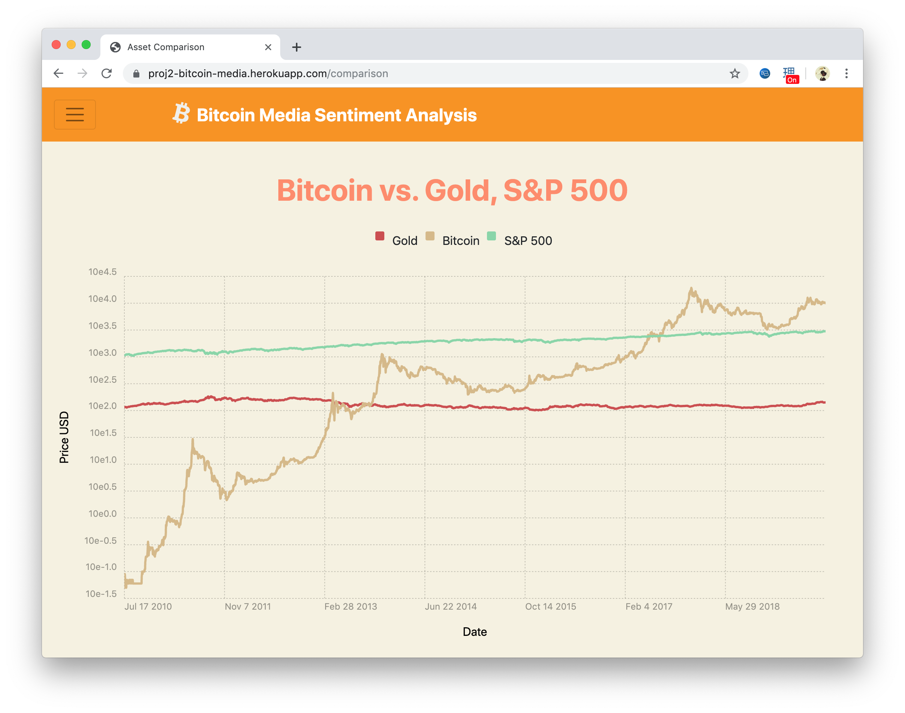

# Bitcoin Media
## A website for exploring online sentiment and other media based trends regarding bitcoin and its price
A flask based web application that visualizes sentiment on bitcoin. We explored mainstream news outlets, twitter trends and google search trends.

## Screenshots

